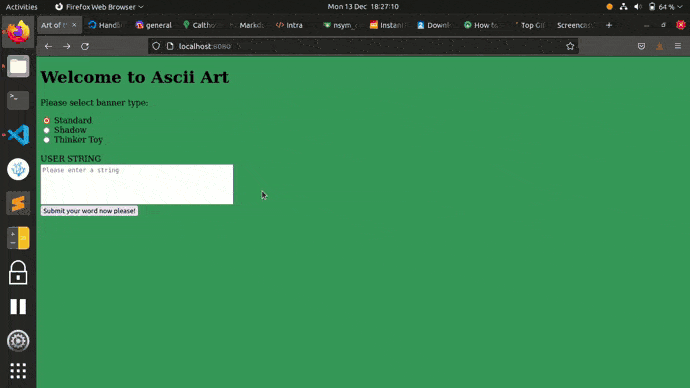

# README FOR ASCII-ART-WEB-DOCKERIZE

This is the same project as ascii-art-web but has been dockerized with the addition of a docker file and relevant scripts.


## Description:

This is a website that converts any string that is entered into ascii art and displays it.

Ascii Art is a program that consists of receiving a string as an argument and outputting the string in a graphic representation using ascii characters.

## Authors:

[Arnold Mutungi](https://git.learn.01founders.co/abmutungi) & [Yonas Million](https://git.learn.01founders.co/nsym_coding)

## Usage:

To test locally run the following in the terminal

```sh
go run main.go
```

Next, go to http://localhost:8080

See in gif below how to turn any given string of text into ascii art





## Implementation Details (Algorithm):

### The algorithm used in converting the string entered to ascii art is as follows:


- When the user has selected the banner of their choice, entered their string, and pressed the submit button:

-The server will receive the banner choice of the user and the string that they entered and store both of them in variables.

-The server will then use the variable of the banner chosen by the user to select the banner that the string will be displayed and open the corresponding text file with an os.Open command.

-After the text file has been selected and opened, the variable that the user string has been assigned to has a function applied to it, a function that splits the string every time there's a new line.

-The banner file that has been opened is then put into a map with every character in the ascii mapped to it's ascii value which means that each character in the string can be matched to it's corresponding ascii.

- Once they're matched they are looped through, line by line and character by character before being appended to a empty slice that is then converted to a string before being sent back to the client and displayed on the webpage.

